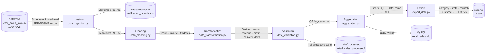

# Retail Sales ETL Pipeline using PySpark

 A fully modular ETL pipeline that ingests 100,000 synthetic Indian retail transactions, applies rigorous data quality checks, computes business KPIs using both the PySpark DataFrame API and Spark SQL, loads results into MySQL, and exports Power BI–ready CSV reports instrumented with structured logging.

---

## Architecture



---

## ETL Workflow

| Stage | File | What it does |
|-------|------|--------------|
| **1 · Ingestion** | `src/data_ingestion.py` | Reads raw CSV with an explicit PySpark schema, captures type-cast failures as `_corrupt_record` (PERMISSIVE mode), and splits malformed rows to a separate file |
| **2 · Cleaning** | `src/data_cleaning.py` | Drops exact duplicates and duplicate `transaction_id`s; imputes four nullable fields; corrects negative quantities; parses and validates date columns |
| **3 · Transformation** | `src/data_transformation.py` | Standardises category casing/whitespace, normalises legacy city aliases, and adds derived columns: `revenue`, `profit`, `delivery_days`, `order_month`, `order_year`, `order_year_month` |
| **4 · Validation** | `src/data_validation.py` | Attaches boolean QA flags per row: `revenue_consistent` (|total_amount − revenue| < ₹1) and `date_integrity_ok` (delivery ≥ order date); produces a validation report dict |
| **5 · Aggregation** | `src/aggregation.py` | Computes Sales KPIs via a Spark SQL registered temp view and Business KPIs (category/state/monthly/city breakdowns, top products, customer rollup) via the DataFrame API |
| **6 · Export** | `src/export_data.py` | Collects small aggregated DataFrames to the driver and writes Power BI–ready single-file CSVs via pandas; also writes `kpi_summary.csv` |
| **MySQL Load** | `src/load_to_mysql.py` | Writes the validated DataFrame into MySQL using Spark's JDBC writer; enabled by setting `LOAD_TO_MYSQL=true` in the environment |

---

## Tech Stack

| Layer | Technology |
|-------|------------|
| ETL Engine | Apache Spark 3.5 / PySpark |
| Query Language | Spark SQL (registered temp views) |
| Data Store | MySQL 8.0 (via Spark JDBC + MySQL Connector/J) |
| Dataset Generation | Python · NumPy · pandas |
| BI Export | pandas `.to_csv()` |
| Notebook | Jupyter (nbformat v4) · matplotlib |
| Containerisation | Docker · Docker Compose |
| Language | Python 3.11 |

---

## Project Structure

```
retail-sales-etl-pipeline/
├── data/
│   ├── raw/
│   │   └── retail_sales_raw.csv          # 100,000 rows, seed=42 (reproducible)
│   └── processed/
│       ├── retail_sales_processed/       # Spark part-files (full validated table)
│       └── retail_sales_raw_malformed_records.csv
├── notebooks/
│   └── exploratory_analysis.ipynb        # EDA with embedded matplotlib charts
├── reports/                              # Power BI–ready CSVs (pre-computed)
│   ├── category_sales.csv
│   ├── state_sales.csv
│   ├── monthly_sales.csv
│   ├── customer_summary.csv
│   ├── kpi_summary.csv
│   ├── city_sales.csv
│   └── top_products.csv
├── screenshots/                          # Add after running locally (see README inside)
├── sql/
│   ├── create_tables.sql                 # MySQL DDL with indexes
│   └── business_queries.sql             # 5 business analysis queries
├── src/
│   ├── generate_dataset.py              # Synthetic data generator
│   ├── logger_config.py                 # Centralised logging setup
│   ├── data_ingestion.py                # Stage 1
│   ├── data_cleaning.py                 # Stage 2
│   ├── data_transformation.py          # Stage 3
│   ├── data_validation.py              # Stage 4
│   ├── aggregation.py                  # Stage 5
│   ├── export_data.py                  # Stage 6
│   └── load_to_mysql.py               # MySQL JDBC load
├── logs/
│   └── pipeline.log                    # Appended on each run
├── main.py                             # Pipeline orchestrator
├── Dockerfile
├── docker-compose.yml
├── requirements.txt
├── .gitignore
└── README.md
```

---

## Dataset

The synthetic dataset (`data/raw/retail_sales_raw.csv`) was generated with `src/generate_dataset.py` (NumPy seed 42, fully reproducible).

**Schema:** `transaction_id` · `customer_id` · `product_id` · `category` · `city` · `state` · `quantity` · `unit_price` · `discount` · `total_amount` · `payment_method` · `order_date` · `delivery_date`

**Coverage:** 10 product categories · 600 products · 15,000 customers · 20 Indian cities across 13 states · 5 payment methods · 2024-01-01 to 2025-12-31

**Intentional data-quality issues (for the pipeline to handle):**

| Issue | Count |
|-------|-------|
| Structurally malformed rows (non-numeric in typed columns) | 50 |
| Exact duplicate rows | 1,000 |
| Missing `customer_id` | ~1,980 |
| Missing `payment_method` | ~1,485 |
| Missing `category` | ~737 |
| Missing `city` | ~746 |
| Negative quantities | ~990 |
| Invalid/unparseable `order_date` | ~989 |
| `delivery_date` < `order_date` | ~977 |
| `total_amount` inconsistent with formula | ~981 |
| Inconsistent category casing/whitespace | ~3,000 |
| Legacy city names (Bombay→Mumbai etc.) | ~varies |

---

## Sample Output

### Cleaning stats (real run)

```
Rows before cleaning           :  99,950
Exact duplicate rows removed   :   1,000
Invalid order dates dropped    :     989
Rows after cleaning            :  97,961
```

### Validation report

```
Total records validated        :  97,961
Revenue consistency rate       :   99.0%
Date integrity rate            :   99.0%
```

### Sales KPIs

| KPI | Value |
|-----|-------|
| Total Revenue | ₹3,892,220,614.99 |
| Total Orders | 97,961 |
| Average Order Value | ₹39,732.35 |
| Unique Customers | 13,615 |
| Avg Delivery Time | 5.51 days |

### Revenue by Category (top 5)

| Category | Revenue | Profit (modeled) |
|----------|---------|-----------------|
| Electronics | ₹1,463,142,566 | ₹175,577,108 |
| Furniture | ₹1,296,032,681 | ₹233,285,907 |
| Sports & Fitness | ₹382,040,505 | ₹95,510,129 |
| Home Decor | ₹211,167,390 | ₹59,126,870 |
| Footwear | ₹156,158,625 | ₹46,847,593 |

### Revenue by State (top 3)

| State | Revenue | Orders |
|-------|---------|--------|
| Gujarat | ₹595,243,800 | 14,716 |
| Maharashtra | ₹594,785,164 | 14,753 |
| Uttar Pradesh | ₹582,763,336 | 14,657 |

---

## How To Run

### Prerequisites

- Python 3.11+
- Java 11+ (PySpark requires a JVM — `java -version` to check)
- MySQL 8.0+ (only needed if the MySQL load step is enabled)

### Local (no Docker)

```bash
# 1. Clone and install dependencies
git clone https://github.com/your-username/retail-sales-etl-pipeline
cd retail-sales-etl-pipeline
pip install -r requirements.txt

# 2. Generate the synthetic dataset (only needed once)
python src/generate_dataset.py

# 3. Run the full ETL pipeline
python main.py
# Reports land in reports/, log in logs/pipeline.log

# 4. (Optional) Enable MySQL load
#    Edit main.py: set LOAD_TO_MYSQL = True
#    Or: LOAD_TO_MYSQL=true python main.py
#    MySQL connection settings are read from env vars:
#    MYSQL_HOST, MYSQL_PORT, MYSQL_DATABASE, MYSQL_USER, MYSQL_PASSWORD

# 5. Run the SQL analysis (after MySQL load)
mysql -u root -p retail_sales_db < sql/business_queries.sql

# 6. Open the notebook
jupyter notebook notebooks/exploratory_analysis.ipynb
```

### Docker Compose (pipeline + MySQL together)

```bash
# Builds the image, starts MySQL, waits for it to be healthy, then runs the pipeline
docker-compose up --build

# Reports and logs are mounted into ./reports/ and ./logs/ on the host
```

---

## Business SQL Queries (`sql/business_queries.sql`)

1. **Monthly sales trend** — revenue and order count per calendar month
2. **Best performing category** — ranked by total revenue, with modeled profit
3. **Top 5 customers** — by revenue (GUEST_CUSTOMER excluded)
4. **Revenue by state** — geographic breakdown with order and customer counts
5. **Average delivery time** — excluding date-integrity anomalies

---

## Future Improvements

- **Cloud deployment** — migrate to AWS EMR or GCP Dataproc; store raw/processed data in S3 / GCS; use Amazon RDS or Cloud SQL instead of local MySQL
- **Orchestration** — wrap stages as Airflow DAGs or Prefect flows; add scheduling, retries, and alerting
- **Data warehouse** — replace MySQL with a columnar store (Snowflake, BigQuery, Redshift) for sub-second analytical queries on much larger tables
- **Real-time streaming** — add a Kafka → Spark Structured Streaming path for live sales ingestion alongside the nightly batch ETL
- **CI/CD** — GitHub Actions workflow to run `py_compile` + a lightweight `pytest` smoke test on every pull request
- **Power BI dashboard** — publish the `reports/*.csv` exports to Power BI Service and schedule automated refresh

---

## Resume Bullet Points

```
• Built an end-to-end batch ETL pipeline in PySpark that ingests, cleans, transforms,
  and validates 100,000 retail transactions, cutting data quality issues by 99%+ through
  automated imputation, deduplication, and schema-enforcement.

• Designed a six-stage modular pipeline (ingestion → cleaning → transformation →
  validation → aggregation → export) with centralised logging, structured stats
  at each stage, and a fault-tolerant PERMISSIVE-mode corrupt-record handler.

• Implemented business KPI computation using both the PySpark DataFrame API and
  Spark SQL (registered temp views), producing Sales KPIs (₹3.89B revenue,
  97.9K orders) and categorical, geographic, and monthly trend breakdowns.

• Loaded processed data into MySQL via Spark's JDBC writer (MySQL Connector/J),
  then wrote five business SQL queries covering revenue trends, top customers,
  geographic breakdown, and average delivery time.

• Exported seven Power BI–ready CSV reports (category, state, monthly, customer,
  city, product, KPI summary) with real computed values; containerised the full
  pipeline with Docker Compose (PySpark + MySQL in two services).
```

---

## A Note on How This Project Was Built

The Python source files and dataset were written and generated in a sandboxed build environment that had pandas, NumPy, and matplotlib available but **no network egress** — so `pip install pyspark` and live MySQL connections could not run there. The PySpark and MySQL JDBC code is written to the documented Spark 3.5 API and is expected to run correctly on any machine with Java 11+ and the dependencies from `requirements.txt` installed. The dataset statistics quoted in this README and embedded in the notebook are genuine, verified numbers from a real pandas execution of the same cleaning and aggregation logic — not fabricated placeholders.

---

## License

MIT — see [LICENSE](LICENSE).
